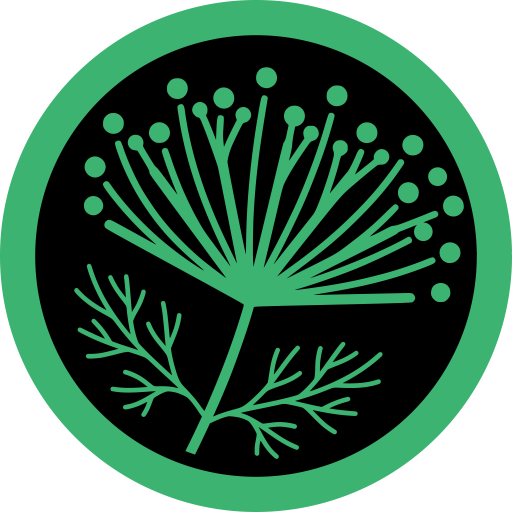

# <p align="center"><br>🌿 DueDill: Model Context Protocol (MCP) Server</p>

A self-contained local Model Context Protocol (MCP) server that connects local LLM agents directly to the **DueDill** systematic company valuation and investment due diligence framework.

This server enables local agents (running in **VS Code GitHub Copilot Chat**, **Cursor**, or **Claude Desktop**) to autonomously checklist gates, parse scores, extract key evidence, and compile formatted dossiers using the exact same programmatic parsing engines and templates as the manual web application.

> [!TIP]
> **Live Web Application**: You can access the manual interactive web interface at [duedill.britl.uk](https://duedill.britl.uk). The MCP server acts as the local API companion to this client-side experience.

---

### 🥒 The "Due Dill" Botanical Taxonomy
> *While "DueDill" might sound like a developer's spelling slip-up of **"Due Diligence"**, we prefer to think of it as a **dill flower** reaching peak maturity. Like the dill plant going to seed, this tool helps your investment ideas mature, ripen, and flower—ensuring your portfolio gets seasoned properly instead of turning into a sour pickle!*

---

## 🛠️ The Core Workflow Pipeline

```
  [list_gates]          [get_gate_prompt]          [parse_gate_response]        [compile_final_report]
        │                       │                            │                             │
  Checklist and ──────> Normalized Prompt ─────────> RegExp Parsers ───────────> Markdown Compiler
  Weights Map           (Dynamic Company)            (Rating & Evidence)          (Optimized for Affine)
```

---

## 📋 Tool Catalog

The server registers the following stdio tools to your agent context:

| Tool Name | Parameters | Description | Returns |
| :--- | :--- | :--- | :--- |
| **`list_gates`** | None | Retrieves the checklist of all 5 due diligence pillars, weight proportions, and evaluation purposes from `manifest.json`. | JSON gate metadata |
| **`get_gate_prompt`** | `gateId` *(number/string)*,<br>`company` *(string)* | Reads the gate template, prepends the global analysis guidelines from `00-core-principles.md`, and interpolates `{COMPANY}` tokens. | Normalized markdown prompt |
| **`parse_gate_response`** | `gateId` *(number)*,<br>`responseText` *(string)* | Analyzes raw model output using the app's RegExp patterns to extract scores, result flags, key evidence, and references. | JSON metrics summary |
| **`compile_final_report`** | `company` *(string)*,<br>`responses` *(object)*,<br>`ratings` *(object)*,<br>`keyReasons` *(object)* | Aggregates parsed results and syntheses across all five gates to build the final high-conviction dossier. | Synthesized markdown report |

---

## 📂 Prompt Asset Vault

All prompt templates are located inside the local `prompts/` directory:
*   **`00-core-principles.md`**: Standard guidelines on capital skepticism, source verification, and downside scenarios.
*   **`gate-1-fundamental-quality-screen.md`**: 3-year revenue CAGR, net cash-to-debt, and FCF quality screens.
*   **`gate-2-rule-of-40.md`**: Evaluates growth efficiency + FCF margins against direct peers.
*   **`gate-3-moat-test.md`**: Chinese reverse-engineering moat durability stress test.
*   **`gate-4-ceo-filter.md`**: Capital allocation history, related-party issues, and skin-in-the-game checks.
*   **`gate-5-valuation.md`**: DCF scenario analysis and revenue-vs-margin sensitivity grids.
*   **`final-report-compiler.md`**: Synthesis instructions for compiling final executive summaries, key risks, and portfolio fit recommendations.

---

## ⚙️ Setup & Installation

1. Make sure you have **Node.js** (v18+) installed.
2. Clone or navigate to the server folder and install dependencies:
   ```bash
   cd DueDILL_MCP
   npm install
   ```
3. Verify that the server compiles and boots cleanly on standard I/O:
   ```bash
   node index.js
   ```
   *(Press `Ctrl+C` to close. Standard logs are piped to stderr so as not to corrupt standard JSON-RPC data packets)*.

---

## 💻 Connecting Local Agents in VS Code

VS Code (v1.99+) natively supports Model Context Protocol servers in Copilot Chat when using local models.

### 1. Requirements
*   **Ollama**: Installed and running locally.
*   **Tool-Calling Model**: You **MUST** select a local model that natively supports tool/function calling:
    *   *Recommended*: `qwen2.5-coder` (e.g., `qwen2.5-coder:14b` or `7b`), `gemma4:12b` (or other sizes like `27b`), `llama3.1` (8B+), or `mistral-nemo`.
    *   *Note*: Standard models without function-calling capabilities cannot trigger MCP actions.

### 2. Configure `mcp.json`
You can configure the server at the workspace level or globally.

#### Workspace-Level Configuration (Recommended)
Create a `.vscode/mcp.json` file in your project directory:

```json
{
  "servers": {
    "duedill-mcp": {
      "command": "node",
      "args": ["e:/Qsync/_github/andrew72nd/DueDILL_MCP/index.js"]
    }
  }
}
```
*(Always use forward slashes `/` for Windows file paths in JSON).*

#### Global Configuration
1. Open the VS Code Command Palette (`Ctrl+Shift+P` / `Cmd+Shift+P`).
2. Search and select: **`MCP: Open User Configuration`**.
3. Add the `duedill-mcp` settings block to the list of servers.

#### 🤖 Auto-Installation via AI Agent
If you are currently chatting with an AI agent in this workspace (like Cursor Composer or Copilot Agent), you can simply copy-paste this prompt to have the agent set up the MCP server for you:
> "Please self-install and configure this workspace's MCP server: locate the absolute path to `index.js` in this directory, create the `.vscode/mcp.json` file pointing to it (ensuring forward slashes are used for the Windows path), run `npm install` in this directory to load dependencies, and run a quick verification start to verify the server boots successfully."

---

## 🤖 Typical Agentic Workflows

We highlight two ways to operate this MCP server: the **Single-Prompt Autonomous Loop** (recommended) and the **Manual Step-by-Step Walkthrough**.

### ⚡ The Single-Prompt Autonomous Loop (One Prompt)

When in **Agent Mode** (e.g., Copilot Chat Agent, Cursor Composer, etc.), the entire multi-gate evaluation and compilation process can run autonomously from **exactly one user prompt**:

#### **[USER PROMPT]**
> `duedill <company_name>`

#### **[AUTOMATED AGENT ACTIONS]** (Autonomous Execution Loop)

```
  [USER PROMPT]: "duedill AAPL"
        │
        ▼ (Autonomous agent execution starts)
  1. [AUTOMATED TOOL CALL] ──> list_gates()
        │                      Retrieves evaluation pillars, weights, and details
        ▼
  2. For Gate 1 to 5 (Sequentially):
     ├──> [AUTOMATED TOOL CALL] ──> get_gate_prompt(gateId: i, company: "AAPL")
     │                              Retrieves evaluation guidelines (including Core Principles)
     ├──> [AUTOMATED SEARCH/WEB] ──> Agent performs web searches, reads documents, gathers financials
     ├──> [AUTOMATED THOUGHT] ────> Agent conducts gate evaluation & drafts gate-level markdown output
     └──> [AUTOMATED TOOL CALL] ──> parse_gate_response(gateId: i, responseText: "...")
                                    Extracts metrics: rating (0-100), keyEvidence, finalReportInput
        ▼
  3. Executive Summary / Final Compilation:
     ├──> [AUTOMATED TOOL CALL] ──> get_gate_prompt(gateId: "final", company: "AAPL")
     ├──> [AUTOMATED THOUGHT] ────> Agent synthesizes final chapter utilizing all gate report inputs
     └──> [AUTOMATED TOOL CALL] ──> compile_final_report(company: "AAPL", responses, ratings, keyReasons)
                                    Aggregates and formats the final markdown dossier
        ▼
  [OUTPUT] ───────────────────────> Displays the final compiled Affine-ready markdown report to user
```

---

### 📝 Manual Step-by-Step Walkthrough (User-Driven)

If you prefer to control each phase manually or are in standard chat mode:

*   **Step 1: Get Checklist**
    *   **[USER PROMPT]**: `"Evaluate NVDA. Start the DueDill workflow."`
    *   **[AUTOMATED TOOL CALL]**: Agent runs `list_gates` to map weights and goals.
*   **Step 2: Gate-by-Gate Analysis**
    *   **[USER PROMPT]**: `"Get the prompt for Gate 1"`
    *   **[AUTOMATED TOOL CALL]**: Agent calls `get_gate_prompt(gateId: 1, company: "NVDA")`.
    *   *Next, the agent conducts research using workspace files or search tools, and responds with the analysis.*
    *   **[USER PROMPT]**: `"Parse the Gate 1 response"`
    *   **[AUTOMATED TOOL CALL]**: Agent calls `parse_gate_response(gateId: 1, responseText: "...")`.
    *   *(Repeat for Gates 2 through 5).*
*   **Step 3: Executive Synthesis**
    *   **[USER PROMPT]**: `"Draft the final executive summary"`
    *   **[AUTOMATED TOOL CALL]**: Agent calls `get_gate_prompt(gateId: "final", company: "NVDA")` and synthesizes the core summary.
*   **Step 4: Final Assembly**
    *   **[USER PROMPT]**: `"Compile the final report"`
    *   **[AUTOMATED TOOL CALL]**: Agent calls `compile_final_report(company: "NVDA", responses, ratings, keyReasons)` to generate the final Markdown document.

---

## 📄 License

This project is open-source and available under the [MIT License](LICENSE).
